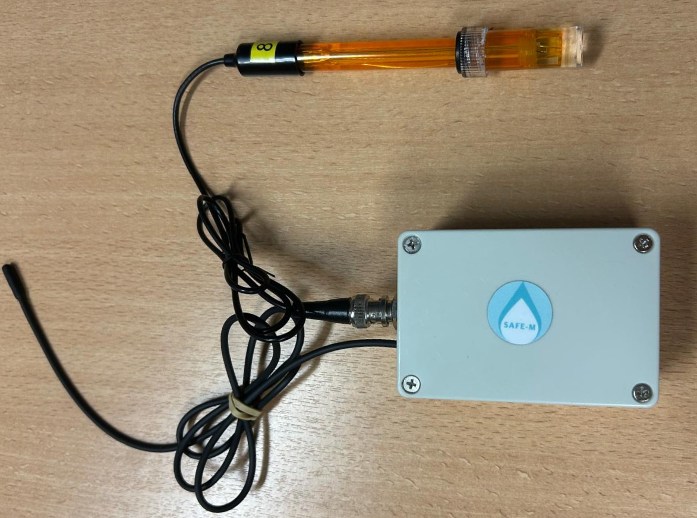
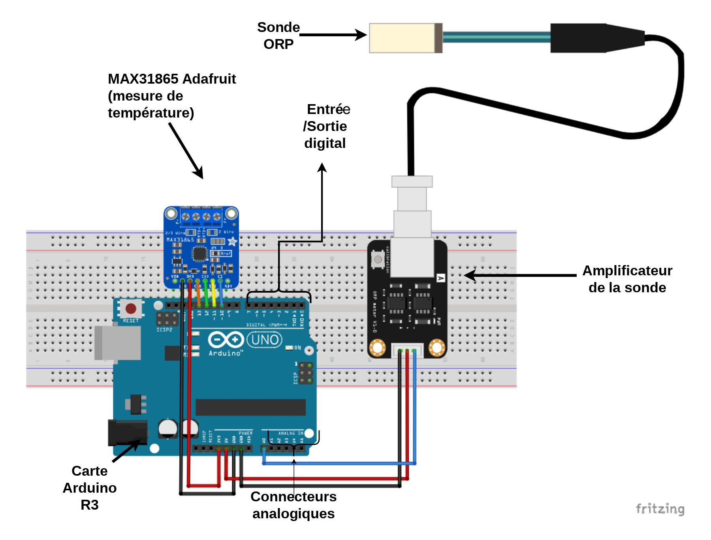

# SAFE-M-ORP: une sonde low cost de mesure du potentiel d'oxydoréduction pour l'enseignement

* [Introduction](##introduction)
* [L'appareil](##appareil)
* [Scripts](##arduino-scripts)
* [Programme python](##python)

## Introduction <a class="anchor" id="introduction"></a>

* Ce programme permet de contrôler une sonde ORP (*Oxidation‑Reduction Potential*) arduino équipé d'une sonde de température PT100.
* Il résulte d'un travail collectif effectué par des étudiants de Licence 3 de l'Institut de physique du globe de Paris.
* Il est distribué sous la licence créative common ***CC-by-SA 4.0***
* Pour le citer:
M. Velasco, P. Martin, A. Levasseur, A. Boubakour, H. Ast, R. Godard-Galves, I Or.lovic, S. Maurice, I. Piketty, L. Avney-On, I. Ferrand, A.Faura  et sous la direction de F.Métivier (2026).

SAFE-M-ORP, une sonde ORP low cost pour l'enseignement [Computer software] https://github.com/SAFE-M/SAFE-M-ORP-.git .

## L'appareil <a class="anchor" id="appareil"></a>
<p align="center">
  
</p>
Le principe de l'appareil reprend les spécifications de ***DFROBOT*** https://wiki.dfrobot.com/PH_meter%28SKU__SEN0161%29 .
Deux ajouts sont effectués afin d'améliorer la précision:

* une sonde de température PT100 a été ajoutée afin de corriger, partiellement, de l'effet de la température;
* la calibration de la sonde ORP est effectuée et contrôlée par le programme Python.

Les sondes ORP sont reliées à l'arduino via un amplificateur de signal muni d'un potard permettant de régler la gamme de tension.

Le montage est effectué au moyen d'une carte PCB dessinée avec Fritzing 
<p align="center">
  
</p>

## Script Arduino <a class="anchor" id="arduino-scripts"></a>

Le script arduino consiste à demander à l'appareil d'effectuer des mesures à une fréquence de 10Hz et les envoyer sur le port série. Les mesures sont, d'une part, une mesure du voltage renvoyée par l'éléctrode Ag/AgCl de la sonde et d'autre part une mesure de température renvoyée par la sonde PT100

## Programme Python <a class="anchor" id="python-and-sql"></a>

La récupération, au moyen du port série, et l'analyse des données sont effectuées au moyen d'un programme python. Pour fonctionner, le programme nécessite, en plus des librairies standard l'installation des librairies suivantes: numpy, matplotlib.pyplot, serial et threading. Pour les installer depuis un terminal, exécuter:
```bash
pip install numpy matplotlib keyboard pyserial threading
```
Une fois les bibliothèques installé, vous pouvez : 
sur **windows** :
 taper `python consigne.py` afin de lancer le programme. 
sur **linux** :
 taper `python3 consigne.py` afin de lancer le programme. 

L'utilisateur peut ensuite lancer le programme en ouvrant le fichier source (.../SAFE-M-ORP/SRC) dans le terminal (de l'ordinateur). 
Il peut également chercher le fichier dans le terminal en utilisant le chemin du fichier SRC et taper : 
```bash
cd "chemin/SAFE-M/ORP" #cd = cd = changes directory
```
Pour des raisons de simplicité le script fonctionne en mode terminal, pas d'interface utilisateur graphique donc, et offre des choix à l'étudiant : 

1) Calibrer la sonde 
2) Mesure simple
3) Mesure en continu
4) Réinitialiser la calibration
5) Tracer un graphique à partir d'un fichier csv
6) Quitter

L'étudiant doit saisir le chiffre de l'action voulu dans le terminal afin de déclencher les actions correspondantes.
Le programme est fait de sorte à ne pas piéger l'utilisateur.
Ainsi, si on ne voit pas d'option pour entregistrer vos données au moment de faire une action, elle est soit faite automatiquement soit sera proposée par la suite.
Un document détaillant le principe d'utilisation de la sonde ainsi que ses limitations se trouve en [documentation](documentation/Rapport_SAFE-M_ORP.pdf). Un [manuel](documentation/manuel/manuel.pdf) d'utilisation est aussi disponible dans la documentation. 

